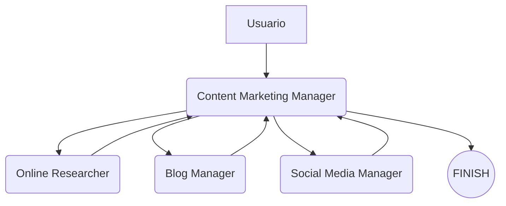

# 🧠 Multi-Agente para Marketing de Contenidos con LangGraph

Este proyecto implementa un flujo de trabajo multi-agente utilizando [LangGraph](https://docs.langchain.com/langgraph/), [LangChain](https://www.langchain.com/) y agentes LLM de OpenAI para automatizar un proceso completo de marketing de contenidos. Incluye agentes especializados que colaboran para realizar investigaciones, redactar blogs optimizados y generar publicaciones para redes sociales.

## 🚀 Descripción del Proyecto

El flujo de trabajo está compuesto por los siguientes agentes:

- **Online Researcher**: Realiza investigación en línea sobre un tema solicitado.
- **Blog Manager**: Toma los hallazgos del investigador y los convierte en un artículo SEO optimizado.
- **Social Media Manager**: Resume el contenido en un tweet atractivo y de alto impacto.
- **Content Marketing Manager**: Coordina el flujo, asignando la siguiente tarea al agente adecuado.

## 🛠️ Tecnologías

- Python 3.10+
- [LangChain](https://www.langchain.com/)
- [LangGraph](https://docs.langchain.com/langgraph/)
- OpenAI GPT-4-Turbo
- BeautifulSoup4
- Tavily Search (como herramienta de búsqueda)
- dotenv

## 📁 Estructura

```
001-basic-multiagent.py        # Código principal del flujo multi-agente
zzz-nb001-basic-multi-agent.ipynb  # Notebook opcional para pruebas
.env                           # Debe contener OPENAI_API_KEY
```

## 🔧 Configuración

1. Crea un archivo `.env` en el directorio raíz con tu clave de API de OpenAI:

```
OPENAI_API_KEY=sk-...
```

2. Instala las dependencias necesarias:

```bash
pip install -r requirements.txt
```

(Recomendado: usa un entorno virtual)

## ▶️ Ejecución

Corre el script principal:

```bash
python 001-basic-multiagent.py
```

El sistema ejecutará una conversación simulada donde los agentes colaboran para entregar el contenido solicitado.

## ✍️ Ejemplo de Prompt

```text
Write me a report on Agentic Behavior. After the research on Agentic Behavior, pass the findings to the blog manager to generate the final blog article. Once done, pass it to the social media manager to write a tweet on the subject.
```

## 📈 Flujo de Trabajo



## 📌 Notas

- La selección del siguiente agente se realiza mediante funciones OpenAI (function calling).
- El sistema es extensible: puedes agregar más agentes fácilmente usando `StateGraph`.

