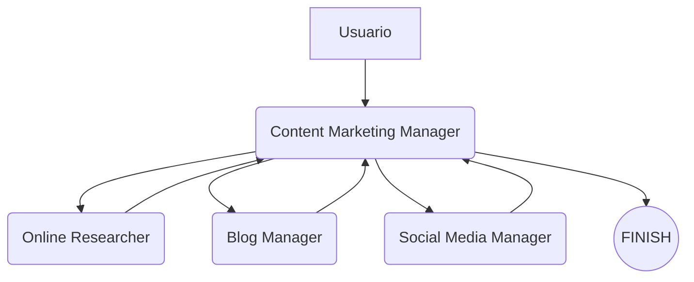

# 🧠 Multi-Agente para Marketing de Contenidos con LangGraph

Este proyecto implementa un flujo de trabajo multi-agente utilizando [LangGraph](https://docs.langchain.com/langgraph/), [LangChain](https://www.langchain.com/) y agentes LLM de OpenAI para automatizar un proceso completo de marketing de contenidos. Incluye agentes especializados que colaboran para realizar investigaciones, redactar blogs optimizados y generar publicaciones para redes sociales.

## 🚀 Descripción del Proyecto

El flujo de trabajo está compuesto por los siguientes agentes:

- **Online Researcher**: Realiza investigación en línea sobre un tema solicitado.
- **Blog Manager**: Toma los hallazgos del investigador y los convierte en un artículo SEO optimizado.
- **Social Media Manager**: Resume el contenido en un tweet atractivo y de alto impacto.
- **Content Marketing Manager**: Coordina el flujo, asignando la siguiente tarea al agente adecuado.

## 🛠️ Tecnologías

- Python 3.10+
- [LangChain](https://www.langchain.com/)
- [LangGraph](https://docs.langchain.com/langgraph/)
- OpenAI GPT-4-Turbo
- BeautifulSoup4
- Tavily Search (como herramienta de búsqueda)
- dotenv

## 📁 Estructura

```
001-basic-multiagent.py        # Código principal del flujo multi-agente
zzz-nb001-basic-multi-agent.ipynb  # Notebook opcional para pruebas
.env                           # Debe contener OPENAI_API_KEY
```

## 🔧 Configuración

1. Crea un archivo `.env` en el directorio raíz con tu clave de API de OpenAI:

```
OPENAI_API_KEY=sk-...
```

2. Instala las dependencias necesarias:

```bash
pip install -r requirements.txt
```

(Recomendado: usa un entorno virtual)

## ▶️ Ejecución

Corre el script principal:

```bash
python 001-basic-multiagent.py
```

El sistema ejecutará una conversación simulada donde los agentes colaboran para entregar el contenido solicitado.

## ✍️ Ejemplo de Prompt

```text
Write me a report on Agentic Behavior. After the research on Agentic Behavior, pass the findings to the blog manager to generate the final blog article. Once done, pass it to the social media manager to write a tweet on the subject.
```

## 📈 Flujo de Trabajo



## 📌 Notas

- La selección del siguiente agente se realiza mediante funciones OpenAI (function calling).
- El sistema es extensible: puedes agregar más agentes fácilmente usando `StateGraph`.

---

## Explicación del código de herramientas en `ai-content-marketing.py`

Este fragmento define **dos herramientas** (`tools`) que los agentes podrán usar dentro del flujo multiagente.

---

### 1️⃣ Decorador `@tool`

```python
@tool("process_search_tool", return_direct=False)
def process_search_tool(url: str):
    """Parse web content with BeautifulSoup"""
    response = requests.get(url=url)
    soup = BeautifulSoup(response.content, "html.parser")
    return soup.get_text()
```

- **`@tool`**  
  Este decorador de LangChain registra la función como una **herramienta** que un agente puede invocar durante su ejecución.

  - `"process_search_tool"` → **nombre** de la herramienta.
  - `return_direct=False` → el resultado **no** se envía directamente al usuario final; primero lo recibe el agente para procesarlo.

- **Qué hace `process_search_tool`**
  1. Recibe un `url` como argumento.
  2. Hace una petición HTTP con `requests.get(url)`.
  3. Usa **BeautifulSoup** para parsear el HTML (`html.parser`).
  4. Extrae **solo el texto** visible (`get_text()`), sin etiquetas HTML.
  5. Devuelve ese texto como resultado.

📌 **Objetivo**: Tomar un enlace encontrado en una búsqueda web y **limpiarlo** para obtener solo el contenido textual.

---

### 2️⃣ Herramienta de búsqueda web `TavilySearch`

```python
tavily_tool = TavilySearch(
    max_results=1,
    search_depth="basic"
)
```

- `TavilySearch` es un wrapper de LangChain para usar la API de **Tavily**, un motor de búsqueda optimizado para IA.
- **Parámetros**:
  - `max_results=1` → solo devuelve **un** resultado por búsqueda.
  - `search_depth="basic"` → búsqueda rápida, no exhaustiva.

📌 **Objetivo**: Realizar una búsqueda en internet y obtener enlaces relevantes para el agente.

---

### 3️⃣ Lista de herramientas

```python
tools = [tavily_tool, process_search_tool]
```

- Se **agrupan** ambas herramientas en una lista para pasarlas a los agentes.
- Un agente podrá:
  1. **Buscar en internet** con `tavily_tool`.
  2. **Procesar el contenido** de un enlace encontrado con `process_search_tool`.

---

💡 **Resumen**

Este código equipa a los agentes con un **kit de investigación online**:

1. **Búsqueda** de enlaces relevantes (`TavilySearch`).
2. **Extracción y limpieza** del texto de esos enlaces (`process_search_tool`).

---

A continuacion se explica cómo funcionan las funciones `create_new_agent` y `agent_node` dentro del flujo multiagente del ejemplo `ai-content-marketing.py`.

---

## 1️⃣ Función `create_new_agent`

```python
def create_new_agent(llm: ChatOpenAI, tools: list, system_prompt: str):
    prompt = ChatPromptTemplate.from_messages([
        ("system", system_prompt),
        MessagesPlaceholder(variable_name="messages"),
        MessagesPlaceholder(variable_name="agent_scratchpad")
    ])

    agent = create_openai_tools_agent(llm, tools, prompt)
    executor = AgentExecutor(agent=agent, tools=tools)
    return executor
```

### Objetivo

Crea un **agente especializado** con:

- Un **prompt de sistema** que define su rol y responsabilidades.
- Herramientas que puede utilizar durante su ejecución.
- Capacidad de interactuar en una conversación persistente.

### Paso a paso

1. **Definir el prompt**

   - `ChatPromptTemplate.from_messages()` construye el contexto del agente.
   - Incluye:
     - **("system", system_prompt)** → mensaje de sistema que define el rol.
     - **`MessagesPlaceholder("messages")`** → historial de conversación en tiempo real.
     - **`MessagesPlaceholder("agent_scratchpad")`** → espacio para razonamientos intermedios.

2. **Crear el agente**

   - `create_openai_tools_agent(llm, tools, prompt)` → crea un agente LLM con acceso a herramientas.

3. **Empaquetar en un ejecutor**

   - `AgentExecutor(agent=agent, tools=tools)` → lo convierte en un objeto listo para ejecutarse.

4. **Retorno**
   - Devuelve el `executor`, el agente final configurado.

📌 **En resumen**: `create_new_agent` es una **fábrica de agentes** con personalidad, memoria y herramientas.

---

## 2️⃣ Función `agent_node`

```python
def agent_node(state, agent, name):
    result = agent.invoke(state)
    return {"messages": [HumanMessage(content=result["output"], name=name)]}
```

### Objetivo

Convertir un agente en un **nodo** para el grafo de LangGraph.

### Paso a paso

1. **Ejecutar el agente**

   - `agent.invoke(state)` → pasa el estado actual (`state`) al agente.
   - El `state` incluye:
     - Historial de mensajes.
     - Resultados intermedios.
     - Variables globales.

2. **Construir mensaje de salida**

   - Toma `result["output"]` y lo envuelve en un `HumanMessage` con:
     - `content` → texto generado.
     - `name` → etiqueta del agente.

3. **Retorno en formato LangGraph**
   - Devuelve `{"messages": [mensaje]}` para integrarse en el flujo.

📌 **En resumen**: `agent_node` adapta un agente para que sea un nodo ejecutable dentro del grafo multiagente.

---

## 💡 Relación entre ambas funciones

- `create_new_agent` **construye** y configura el agente.
- `agent_node` **integra** ese agente dentro de un flujo de LangGraph.

```mermaid
flowchart LR
%% ==== Entrada y orquestación ====
Start((entrypoint)) --> CM["content_marketing_manager<br>(StateGraph node)"]
CM -->|next: online_researcher| R["online_researcher<br>AgentExecutor"]
CM -->|next: blog_manager| B["blog_manager<br>AgentExecutor"]
CM -->|next: social_media_manager| S["social_media_manager<br>AgentExecutor"]
CM -->|next: FINISH| END((END))

%% ==== Retorno de control al manager ====
R -->|"&#123;messages: [HumanMessage(...)]&#125;"| CM
B -->|"&#123;messages: [HumanMessage(...)]&#125;"| CM
S -->|"&#123;messages: [HumanMessage(...)]&#125;"| CM

%% ==== Cómo se crean los agentes (create_new_agent) ====
subgraph Factory["create_new_agent(llm, tools, system_prompt)"]
P["ChatPromptTemplate<br>(system + MessagesPlaceholder + agent_scratchpad)"]
A["create_openai_tools_agent(llm, tools, prompt)"]
E["AgentExecutor(agent, tools)"]
P --> A --> E
end

%% Cada nodo-agente del grafo es una instancia del AgentExecutor anterior
E -. "instancia" .- R
E -. "instancia" .- B
E -. "instancia" .- S

%% ==== Adaptación a nodo (agent_node) ====
subgraph Adapter["agent_node(state, agent, name)"]
INV["agent.invoke(state)"]
HM{{"HumanMessage(content=result['output'], name=name)"}}
OUT["return &#123;messages: [HumanMessage(...)]&#125;"]
INV --> HM --> OUT
end

%% El adaptador se aplica cuando el nodo-agente se ejecuta
R -. usa .- Adapter
B -. usa .- Adapter
S -. usa .- Adapter

%% ==== Herramientas compartidas ====
subgraph Tools["tools (compartidas)"]
T1["TavilySearch"]
T2["process_search_tool<br>(BeautifulSoup -> get_text)"]
end

R --- T1
R --- T2
B --- T1

```


